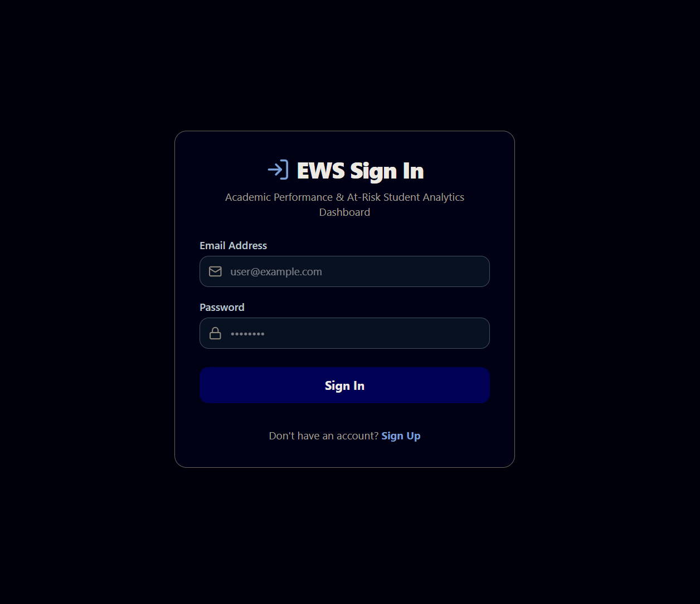

# DWDM: Academic Performance & At-Risk Student Analytics Dashboard

A full-stack web application that helps teachers identify at-risk students early, and gives students visibility into their own predicted risk of falling behind — built on a simulated academic data pipeline (Student LMS data → risk scoring → dashboards) that mirrors how a real early-warning system would work.

---

## 



---

## Live Demo

https://dwdm-frontend.vercel.app/

---

## What This Project Does

Two roles, two experiences:

- **Students** sign up with a unique Student ID, and immediately get a dashboard showing their engagement metrics, performance timeline, predicted risk level, and personalized feedback.
- **Teachers** sign up with a verified Teacher ID, and get a class-wide register of every student — searchable, filterable by risk level, with a detailed per-student profile view (demographics, enrollment info, engagement, and full risk breakdown) available on demand.

Risk is computed from a simple, transparent, explainable formula (not a black box) — deliberately built this way so that every risk label shown to a user can be traced back to a reason, not just a number.

---

## Architecture

```
frontend/          React + Vite + Tailwind CSS
backend/           Node.js + Express + MongoDB (Mongoose)
Database:          MongoDB Atlas (cloud-hosted)
```

**Auth:** JWT-based sessions (2-hour expiry), role-based routing (student/teacher), bcrypt password hashing.

**Data flow (the interesting part):**

```
Signup (student_id provided)
        │
        ▼
Validate ID exists in a simulated external LMS (fake_lms_data.json)
        │
        ▼
Copy that student's data into our own MongoDB (one-time sync)
        │
        ▼
Compute probability, risk_level, and feedback right then
   (placeholder formula — see "Design Decisions" below)
        │
        ▼
Stored permanently on the Student document — read by both
the student's own dashboard AND the teacher's class-wide view
```

This mirrors how a real system would work: an external LMS periodically feeds data in, a model scores it, and the app serves pre-computed results rather than recalculating on every page load.

---

## Features

- **Authentication & RBAC** — separate signup flows for students (email + password + Student ID) and teachers (email + password + verified Teacher ID), JWT sessions, protected routes, role-locked dashboards.
- **Simulated LMS data sync** — student academic data is "pulled" from a stand-in external LMS at signup time, mirroring a real integration boundary without building one.
- **Student Dashboard** — engagement metrics, performance timeline (chart), computed risk level, and generated feedback text, scoped strictly to the logged-in student (identity-driven via JWT, not a URL parameter — no student can view another's data by design).
- **Teacher Dashboard** — real, aggregated cohort stats (total students, at-risk rate, risk distribution), a searchable and filterable student register.
  - **Search** — instant, client-side, matches across name, ID, course, and weak topic.
  - **Filter** — by risk level (Green/Yellow/Red/Black), combinable with search.
- **Analyze Profile** — a detailed per-student modal: identity sidebar, three independently-expandable info cards (Enrollment, Engagement, Risk & Performance), and a performance-over-time chart.
- **Dark/Light theme toggle** — applies app-wide, Tailwind `dark:` variant based.

---

## Repo Structure

```text
DWDM/
├── backend/
│   ├── data/                    # Simulated external systems (valid teacher IDs, fake LMS data)
│   ├── middleware/               # JWT auth middleware
│   ├── models/                   # Mongoose schemas (User, Student, Prediction)
│   ├── routes/                   # authRoutes, dashboardRoutes
│   ├── services/                 # riskEvaluationService, feedbackService
│   └── server.js
├── frontend/
│   └── src/
│       ├── components/           # Sidebar, ProtectedRoute, etc.
│       ├── context/               # Auth state
│       └── pages/                 # Login, Signup, StudentDashboard, TeacherDashboard
├── start-dwdm.bat                # One-click local dev startup (Windows)
└── DEPLOYMENT_GUIDE.md
```

---

## Design Decisions Worth Knowing About

This project was built in disciplined, spec-first phases — every non-trivial decision was deliberated before being built, not improvised. A few worth calling out explicitly, since they were conscious trade-offs, not oversights:

- **The risk/probability formula is a deliberate placeholder**, not a real ML model. It's derived from real synced data (`probability = (100 - latest_score) / 100`), so it's not random — but it's intentionally simple and clearly commented as a stand-in. The actual trained ML model (built separately, handling feature-based prediction from real student marks) is **not** integrated into this app by design — that integration is logged as explicit future work, not a gap I overlooked.
- **The "external LMS" is a static JSON file**, not a live API — a deliberate simulation of an integration boundary that would, in a real deployment, be a network call to a genuinely separate system. Keeping this boundary conceptually real (even while faking the data source) meant the eventual swap-in of a real LMS wouldn't require re-architecting anything.
- **Client-side search/filter, not server-side** — with the current data scale (a single shared teacher roster, no pagination needs), client-side filtering is objectively simpler and faster, not a corner cut. Documented explicitly as scale-appropriate, not a shortcut.
- **All teachers see the full student roster** (no per-teacher scoping) — a deliberate scope decision for this stage of the project, not a missing feature. Per-teacher/per-course visibility is logged as future work.

---

## Known Limitations / Future Work

Logged deliberately, not forgotten:

- Real ML model integration (replacing the placeholder probability formula)
- Real external LMS integration (replacing the static fake-data file with an actual network integration)
- Weekly/periodic re-sync of student data (currently syncs once, at signup)
- Per-teacher student/course scoping (currently: all teachers see all students)
- "View Interventions" panel (UI exists, not yet functional)
- Teacher actions on a student's profile (notes, flags — profile is currently read-only)
- Combined Course + Status filtering on the teacher dashboard (currently Status-only)
- Theme persistence across sessions (currently resets to light on every reload)

---

## Developer Lessons & Takeaways

##### 1. Spec-first discipline pays off with AI coding tools
Every phase of this project was fully discussed and locked into a written spec *before* being handed to an AI coding assistant (Antigravity) for implementation. This caught a lot of ambiguity upfront — e.g., deciding *when* a student's risk score gets computed (at sync time, not on every page load) mattered a lot for correctness, and would've been easy to get wrong if left to be improvised mid-build.

##### 2. Two databases, one door
Modeling "our app's database" and "the external LMS" as two genuinely separate concepts (even though the LMS is currently just a JSON file) made the eventual real integration a clearly-scoped future task instead of an architectural rewrite. It's tempting to just merge fake external data straight into your own database for convenience — resisting that kept the system's real shape honest.

##### 3. Not every risk score needs a real model to be useful (for now)
Building the app around clearly-labeled placeholder logic (transparent formula, commented as temporary, real ML model explicitly deferred) meant the whole pipeline — signup → sync → compute → store → display — could be fully built, tested, and verified end-to-end, without being blocked on a separate, harder ML integration effort.

---

## Local Development

See `start-dwdm.bat` for one-click local startup (Windows), or run manually:

```bash
# Backend
cd backend
npm install
npm run dev

# Frontend (separate terminal)
cd frontend
npm install
npm run dev
```

Requires a `.env` file in `backend/` with `MONGO_URI`, `JWT_SECRET`, and `PORT`; and a `.env` file in `frontend/` with `VITE_API_URL`.